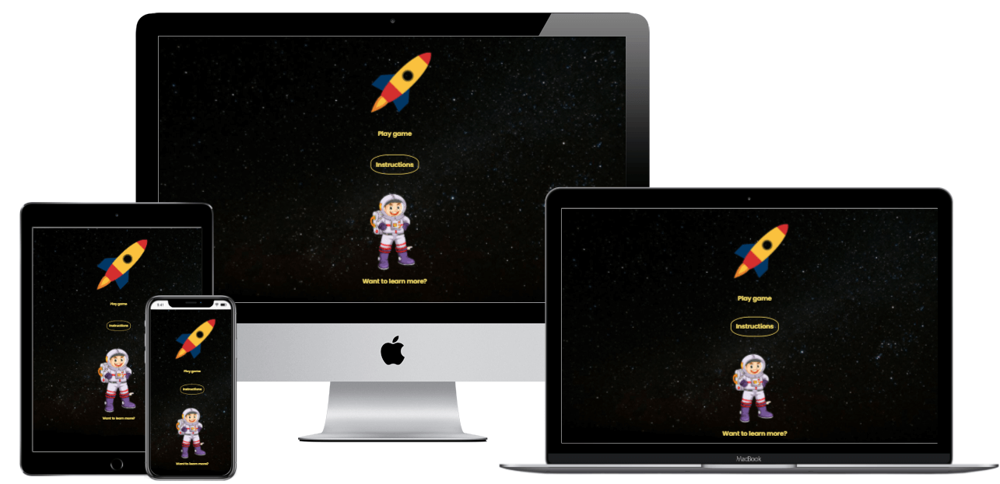
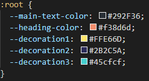

# [Fun Space Game](https://lisahackett97.github.io/fun-space-quiz/?target="_blank")

This is a fun interactive site for kids to learn about space while playing a simple “travel through space game”. User can also view interesting Space related images and facts and send in their own facts or ask questions.
Primary goal of the site is to encourage kids to have fun while learning about space and solar system in a fun, interactive way.

## **To open any links in a new tab, please press Ctrl + click**

## Table of Contents

- [UX](#ux)
  - [External User Goals](#external-user-goals)
  - [Site Owner Goals](#site-owner-goals)
  - [Strategy and Scope](#strategy-and-scope)
  - [Structure](#structure-of-the-website)
  - [Wireframes](#wireframes)
  - [Surface](#surface)
    - [Colors](#colors)
    - [Typography](#typography)
    - [Images](#images)
    - [Features](#features)
- [Technologies](#technologies-used)
- [Testing](#testing)
  - [Functionality testing](#functionality-testing)
  - [Compatibility testing](#compatibility-testing)
  - [User stories testing](#user-stories-testing)
  - [Issues found during site development](#issues-during-development)
  - [Bugs](#bugs)
  - [Performance and Accessibility testing](#performance-and-accessibility-testing)
  - [Code Validation](#code-validation)
- [Deployment](#deployment)
- [Credits](#credits)

---

## UX

### External User goals

As a prospective user, I want to

- Play the game to reach the moon and other planets.
- View questions and answers about space/planets to learn more.
- Be able to see my score for the game.
- View images of planets and space.
- Be able to view the site on mobile/desktop/tablet.
- Be able to access all pages and navigate without confusion, without too many clicks.
- Submit questions.
- Learn more about space.

### Site Owner goals

#### As site owner I want

- To provide a fun, interactive site that is easy to navigate, and can be viewed on different screen sizes.
- The user to enjoy playing the game.
- Give some interesting facts and information on the subject.
- Provide form for users to ask a question or tell us what they know.

### Strategy and scope

Looking at both strategy and scope of the project, I referred back to the user stories, which helped in planning out the project.
On the strategy plane, I did research looking at basic games, quizzes and information relevant to the topic. I also did some research by asking children I know what they like about space. I identified what worked well and not so well from a UX perspective, including colours and how interesting or unusual information is for the user.
Colours and interesting info for my site, I listed out the opportunities/problems and how each of these might be addressed.
And for the scope plane, I planned out the content and functional requirements.

[strategy and scope tables](readme-assets/strategy-scope-plan.pdf)

### Structure of the website

The structure of the site is designed so that on landing on the site, the user can easily go straight
to the game or if they wish, can go to the learn more page, where they can view images/facts about Space and also contact the site owner. Easy to use nav bar to be included on game page and learn more page, from which the user can access the game, view the gallery images and contact the site owner.

[Structure Plan](readme-assets/structure-plane-plan.pdf)

### Wireframes

[Wireframe Mobile](readme-assets/spacegame-wireframe-mobile.pdf)
[Wireframe Tablet](readme-assets/spacegame-wireframe-tablet.pdf)
[Wireframe Desktop](readme-assets/spacegame-wireframe-desktop.pddf)
These were built using balsamiq.

- The main change from the wireframes is that I decided not to have a title on the landing/hpme page, and to add a heading in fi9r the game page for tablet/desktop scrrens.
- Also decided to keep instructionS as a pop up on all screen sizes.

### Surface

[Surface Plan](readme-assets/surface-plane-plan.pdf)

#### Colors

I planned to use bright colours to make a fun visual site.

- fee440
- 8ef9f3
- 00f5d4
- 395c6b
- d33f49

During development, I changed the main colours used, as the original colours were giving some contrast errors when checking with WAVE.

#### Typography

I planned to use Exo2 and Poppins fonts. This did not change during development as the fonts suited the site from a visual perspective.

#### Images

I planned to use landing page full background image, with buttons over-laid, an image for the game area with a planet type icon for each point in the game.
There will also be a success image for when user finishes the game and a number of images for the learn more carousel.

- I decided not to use an image when user finishes the game, as the success pop up modal, worked better. Modal button gives users 3 options: play again,
see the final game image, or naivigate to the learn-more page.

[Back to table of contents](#table-of-contents)

## Features

The site consists of

**_Website has the following features_**

### Landing Page

Contains the following:

- Space/stars background image
- Button to select game play
- Button to go to learn more page
- Button for instructionswhich is a pop up.
- Inside the inctruction modal pop-up, the user then had to option to click to go to the game, or close the pop-up

### Navigation Menu

- Contains links to:
  - Landing page, which is called Home on the navbar.
  - Game play: brings user to top of the game page.
  - Learn More Page, which contains the gallery carousel.
  - Contact form, which is called Ask us anything on the nav bar.
- Navbar is collapsible icon on smaller screens.

### Game Page

Contains the following:

- Navigation menu
- Fly your rocket home heading: This is hidden on smaller screen.
- Game play visual/canvas area, which displays the following:
  - Outer Space Stars background image.
  - Moon icon to represent start of game.
  - Planet Earth icon to represent end of game.
  - Rocket icon to represent progress. For previous steps the rocket is greyed out but still visible.  
- Question and answer area, displaying four possible answers to choose from.
- Button option for user to select a new question.
- Score area: Gives user information on how many questions to answer, and also ho wmany questions they have answered corretly in the game.
- Button option for a new game.
- Modal pop-ups, with option buttons:
  - Correct answer: options for new game and next question.
  - Wrong Answer: options for retry the question, new game and new question.
  - Success: options to close modal and see the final game image, new game and learn more, which brings user to learn more page.
- Footer, containg a link to you-tube.

### Learn More Page

Contains the following:

- Navigation menu
- Want to know more heading: This is hidden on smaller screen
- Gallery Carousel, which contain images and related information.
- Contact form, where the user can ask a question or send a fact/other information they want to share.
- Footer, containg a link to you-tube.

### 404 page

Contains the following:-

- Message for user if they get the 404 error.
- Link back to the landing page
- Background image with animations to slide in the text.

## favicon added to site for personalisation

### Future Features

- Function to limit the number of re-tries of a question, and run a game over function.
- Difficulty levels for questions.
- High Score tables.
- Sounds during game.

[Back to table of contents](#table-of-contents)

## Technologies Used

- HTML5 - Programming language for structuring the site.
- CSS3- Style sheet programming language
- [Bootstrap](https://getbootstrap.com/docs/4.6/getting-started/introduction/) Use as a framework for layout and responsiveness.
- [Font Awesome](https://fontawesome.com/) -used to provide icons across the site.
- [Google fonts](https://fonts.google.com/) -used to select and provide typography.
- [Github](https://github.com/)- software hosting platform to keep project in a remote location
- [Gitpod](https://gitpod.io/) - a development hosting platform
- Git - used for version-control.
- [Balsamiq](https://balsamiq.com/) - used to build wireframes. Downloaded software to use.
- Chrome Dev Tools - used to view responsiveness and layout as site was being developed. I found this very useful when developing the site, as it aided my learning throughout the project.
- Unicorn revealer extension was helpful when developing the site
- WAVE extension for reviewing accessibility and colour contrasts in testing.
- emailjs.com
- [Site to remove backgound on images](https://www.remove.bg/)
- tinyjpg
- paint tool on lao#ptop windows
- [Online kanban tool for plan and management of project tasks](https://lisah.kanbantool.com/login#?)
- [techsini for mock-ups](https://techsini.com/multi-mockup/index.php)
- Validators:
  - jshint
  - validator.w3.org
  - jigsaw.w3.org/css-validator
- [Site for CSS animations](https://animate.style/.)
- favicons.io
- [Crticial style path generator](https://jonassebastianohlsson.com/criticalpathcssgenerator/#what-is)

[Back to table of contents](#table-of-contents)

## Testing

Testing Plan:
For each change/bug resolved, test the feature to ensure working as expected
Once development finished

1. Validate css, html and javascript.
2. Lighthouse reports
3. WAVE accessibility reports
4. Cross browers testing

- Manual testing.
  - Functionality: test each feature on each page. Negative and positive cases. 
  - Review already resolved bugs and test again.
  - User stories testing

- Any changes made, re-run all steps and note any issues

### Functionality Testing

### Compatibility Testing

### User stories Testing

#### As a prospective user, I want to

- Play the game to reach the moon and other planets.
- View questions and answers about space/planets to learn more.
- Be able to see my score for the game.
- View images of planets and space.
- Be able to view the site on mobile/desktop/tablet.
- Be able to access all pages and navigate without confusion, without too many clicks.
- Submit questions.
- Learn more about space.

#### As site owner I want to

- To provide a fun, interactive site that is easy to navigate, and can be viewed on different screen sizes.
- The user to enjoy playing the game.
- Give some interesting facts and information on the subject.
- Provide form for users to ask a question or tell us what they know.

[Back to table of contents](#table-of-contents)

### Issues during development

I used the bootstrap documentation code for the carousel. as I wanted text related to the image to appear under it but using the code exactly as it was in the documentation, did not give the user view on all screens as I wanted. After trying a few different versions I found through research, I decided use the original bootstrap code but modify it. I decided to enclose the images with the figure tag and to use the figcaption tag for the text details.
Img, figure and carousel controls were required to be styled to ensure text appeared beneath img, and ctrls to left/right, without overlap, and also appearing as expected on diff screen sizes.

The fieldset was overflowing on the contact form and appearing on top of the footer. Resolved once styling applied to container and the element itself.

Carousel indicator was overlapping with figcaption elements. Solved by positioing ol and li items to bottom of their container element and styling the items.

The form input boxes overflow fieldset on xs screen size. Resolved by reducing the size of font on input boxes to resolve

When setting up the shuffle questions function, I tried to find a number of ways to do this, including sorting the quiz array, nut couldn't couldn't get anything to work.
When I was researching I came across the fisher yates algorithim method. I wouldn't get it to work but needed to spend more time understanding it.
Once I implemented the function, I then got an issue in the console, where it was telling me .length on the array name wasn't defined. To resolve, I set a new array varaible and passed it in the quiz variable, as quiz variable held in another js file. As I got towards the end of the site developments, I researched linking the javascript files, and implemeted import/export on main script file the one holding the quiz data.

I had issues figuring out how to access the correct answer in the array, tried few diff methods. Needed to set a hidden span, and change format of correct answer in the array. I would like to find a better way of doing this but knowledge and time constraints have prveneted me doing so at this point.

At one point the user was having to keep answering the same question, score continued to increment. Resolution was that the oder of the new question/shuffle functions needed to be changed. If I user gets a question correct, they will get a pop up module and options are to get next question or start a new game.
As I wrote the javascript file, I checke the particular site area each time. When I change didn't work or caused issues like questions disappearing, I would review, including using dev tools to view the console and update javascript. Issues was usually the order of the functions ebing called.

I tried to use a switch case for the draw function, as suggested by my mentor. This is the function that when a user has a score of 1, the first rocket icon is drawn on the game canvas,and will repeat until user has 5 questions answered. I was not able to implement it due to knowledge and time constraints. The if/else statements work with the game as it is.

When I set up reset btns, (to start game over), d-hide modal triggers and opens the modal but if the user answerd incorrctly, the next question button wasn't working.I needed on click to be added to button with id of wrgAnsFocus.

I needed media queries for fig captions and carousel indictors on xs smal screens, also hide h1 heading on small screens and change layout of carousel when heading was hidden.

[Back to table of contents](#table-of-contents)

### Bugs

- On the learn-more page, form area would move on the page, depending on the text content of the figcaptions. Height needed to be set to the figcaption element to resolve.

- Once nav bar was fixed, main content of page was scolling on top of the navbar. Found a solution to set the z-index (code credit in credits section).

- Images did not initially display on the deployed site. For the carousel images, I needed to remove the / before the file path and for the bg images on game and landing pages, I need to change the path to "../images" instead of "/assets/images". These changes resolved the issue on the live site.

- If first question was answered wrong, the game over message was displayed as score was still at 0. Resolved by adding another condition to the if else statement to run the show question function is 0. Display of success modal after 5 questions answered correctly stops user answering further questions

- The footer was floating up on medium and large screens on the game page, as there wasn't enough content to push footer down. Resolution found (see credits section), adding a wrapper on the main body and a div with push slass. Css was then applied

- Game canvas draw element were not showing on the live site. This was resolved as the file path needed to be updated>

- When a new game was called, the first question was not refreshing. To resolve I needed to reoder function calls in the reset Javascript fn.

- email js and field validation were causing a 501 error. To resolve I needed to remove submit function from js file, re-arrange order in email.js, send email function to be first.

- Was getting warnings in jshint in relation to ES6. Resolution found to clear these.
  - jsHint /*jshint esversion:6*/ added to top of js file, removed warnings. found anser on slack.

- jshint getting message about the jquery variable. found solution on [stackoverflow](https://stackoverflow.com/questions/8852765/)/ Comment added to top of js file,  which declares to JSHint that $ is a global variable, and the false indicates that it should not be overridden. Cleared warnings/

- jshint: message that my QuizData was not defined. This is the array of questions held in questions.js
  - Solution on [this site](https://medium.com/recraftrelic/es5-vs-es6-with-example-code-9901fa0136fc). set up import/export on the 2 js files.
    - But this then caused an issue with message of "Uncaught SyntaxError: Cannot use import statement outside a module". Solution to that was found on stackoverflow post
solution:- give js files type of module.
      - This resolved but next issue then related to the onclick events in the html file for next q. Site was not displaying a next q when that onclick removed from modal button. Still works when main new q button selected. Resolution was that Event listeners for next q buttons on wrg answer and correct answer modals needed to be included.

- jshint gives me a msg that emailjs is not defined. However if I do define it, it causes a 501 error or 405 error on live site. Removed the declaration.

- carousel/figures imgs on smaller screens were not taking up full width and looked strected vertically
  - Media query applied to small and x-small screens. Change display of carousel. H1 hidden on sm/xs, therfore imgs take up more of screen and layout is easier to show with small prev/next indicators. Update spacing around headers and font size. 
Reviewed again and decided to change width on carousel items all screen sizes, adjusted column set for large screens, some small adjs for media query sm and xs and reverted to the same colour for  contrls indicators on all screens. Also needed to decrease size of indicators to reduce space they were taking up on screen.

- The game wasn't shuffling questions when new game btn clicked. run game needed to part of the query selector function for reset click event listener.

- If a user keeps clicking next question button without answering, they get to end of array set, and success modal pop up instead of the alert. To resolve in the showQuestion function, add a confirm msg.

- Footer was not filling across the full screen on learn more page after resolving issues/updating carousel for different screen sizes. I was missing a closing div for main container of the learn pg. Issue now resolved.

### Performance and accessibility Testing

#### Lighthouse testing

#### Accessibility

- WAVE extension for further accessibility testing.
  - Contrast Checker I used the wave extension to check contrast. This led to the main colors chosen being changed. Final colours are not causing any contrast errors.
  - Landing Page:
    - No Errors. Two alerts.
      - One alert is that there is no H1 heading. This was a decision on this landing page. images and links are provided to all areas of the site.
      - Second alert says 'No page regions or ARIA Landmarks found". Added role=main to the container and this alert cleared.
  
  - Game page:
    - Three errors, 1 alerts.
      - The three errors were due to the html page containing empty buttons to trigger modals. With havscript functions/events, this buttons are no longer required. Removed all 3, and retested functions. No issues
      - Warning on the p element, as it looks liek a header due to conciseness and size. This is not a header, it is to give text instructions to user to alert them to number of questions to be answered.

  - learn-more page:
    - Two errors, 0 alerts.
      - The two errors are rsulting from having empty buttons. These were the modal trigger buttons. Removed both buttons and retested. No issues, these weren't required for the modals to work. javascript function for sending email included and calls the relevant modal.

[These are the final WAVE reports](readme-assets/WAVE-reports.pdf)

### Code Validation

I used the following to validate code by direct input:

- html https://validator.w3.org/
During development of the site I ran the code through the validator and cleared up issues as I came across them.
- index.html validation. No errors
- game.html valiation. Warning related to aria-label on canvas element. Added role=img and this resolved the warning.
- learn-more.html validation. No errors
- 404.html validation. No errors.

- css http://jigsaw.w3.org/css-validator/

No issues

- jshint https://jshint.com/

No issues on script and questions files. On email.js, messages about one undefined and 3 unused variables.
I used code per emailjs. Tested if could declare variable within file but this caused issues. Noted in bugs section. Variables are used in the script in the learn-more page, to send email.

[These are the final validation reports](readme-assets/validation-results.pdf)

[Back to table of contents](#table-of-contents)

## Deployment

The project was deployed to GitHub pages using the following steps:

1. Log into GitHub and select the repo.
2. Go to settings
3. Select Pages from vertical menu on left
4. On Source, select Master Branch and click save.
5. Website is now live and the URL will be displayed. [Link to live site](https://lisahackett97.github.io/fun-space-quiz/)
6. When updates are commited and pushed to GitHub, live site will be updated.

To download and run locally, follow the below steps:

1. Log into GitHub and select the repository, fun-space-quiz
2. Select Code
3. Click Download Zip
4. Once files have downloaded, you can extract and useclone-project.png locally.

To Clone, follow the below steps:

1. Log into GitHub and select the repository, fun-space-quiz
2. Select Code
3. Click https and copy the link
4. Open git bash
5. Change the working directory to where you want the cloned directory
6. Use command git clone and the copied URL
7. Press ente

Select this file for screenshot [readme-assets/clone-repo.PNG]

Forking the repository:

1. Log into GitHub and select the repository, fun-space-quiz
2. Select Fork on top right hand corner.
3. A copy should be created in your github profile and pull requests submitted.

GitHub docs link [Forking a repository](https://docs.github.com/en/desktop/contributing-and-collaborating-using-github-desktop/cloning-and-forking-repositories-from-github-desktop#forking-a-repository/)

## Credits

### Media

#### Images Used

Images are credited as follows:

- unsplash.com

  - carousel-pluto
  - carousel-saturn  
  - carousel-neptune
  - carousel-venus
  - carousel-mars
  - carousel-mercury
  - carousel-uranus
  - carousel-jupiter
  - carousel-the-sun
  - carousel-diamonds
  - carousel-earth
  - 404-bg
  - game-stars

- Pexels.com

  - landing-stars
  - carousel-galaxy

- vecteezy.com/free-vector/

  - game images: Earth, moon and rocket (with rocket img being adjusted with windows paint tool for the done icon)
  - landing-rocket
  - landing-astronaut

- shutterstock.com standard licence

  - carousel-asteroid-dino

#### Other

- I used some slide in animations on text on the 404 page. This was created from the following site. [animations](https://animate.style/)
- favicons.io for site favicon.

### Content

- content from quiz on the following site, with some additional quiz content take from the 2nd site
  - funtrivia.com
  - kidsworldfun.com

- content for carousel on learn more page
  - planetsforkids.org
  - parenting.firstcry.com/articles/20-must-know-facts-about-space-for-kids/
  - space-facts.com/planets/
  - esa.int

### Colours

I used cooler.co to select inital colours. During development I changed colors using color picker in wave extension and [this site](https://www.colorcombos.com/combolibrary.html).

### Code

- webkits Prefixed by [autoprefixer](https://autoprefixer.github.io)
- code for sticky footer [css-tricks](https://css-tricks.com/couple-takes-sticky-footer/)
- solution to an issue with navbar and content z-indez was found on [Freecodecamp.org](https://forum.freecodecamp.org/t/why-is-my-navbar-behind-other-content/62059)
- Help with using the fisher-yates method to shuffle the quiz array questions found on the following sites:
  - [tutorialspoint.com](https://www.tutorialspoint.com/)
  - [bost.ocks.org](https://bost.ocks.org/mike/shuffle/)
- I followed the code institute lesson on email js when implementing the email functions

### Acknowledgements

code on how to set focus to nextq button on modal, found on stackoverflow